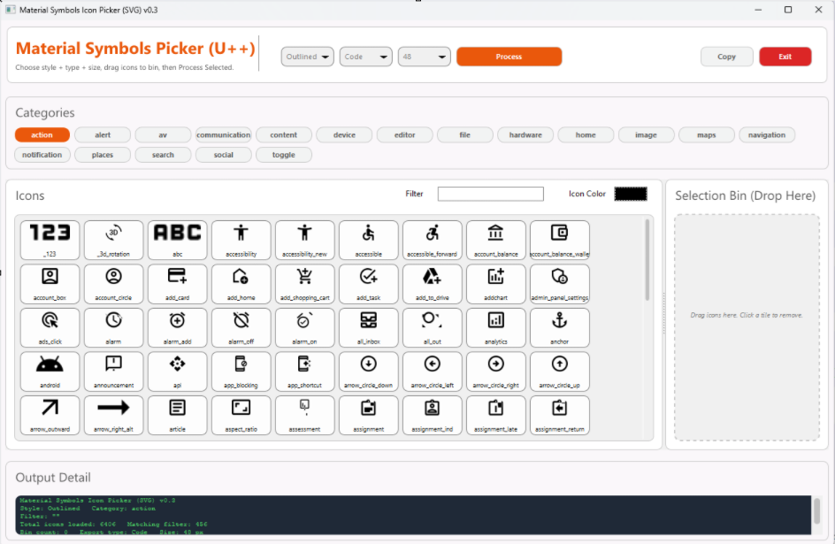

# Material Symbols Icon Picker (U++)

_A desktop helper tool for browsing, filtering and exporting **Google Material Symbols** as images or inline C++ resources._



> Version: **v0.3**  
> Framework: **Ultimate++ (U++)**

---

## 1. What this tool does

This app lets you:

- Browse the full **Material Symbols** icon set
- Filter by:
  - **Style**: Outlined / Rounded / Sharp  
  - **Category**: action, alert, av, maps, social, etc.
  - **Name** via a live **search box**
- Choose a **render size** (16–256 px)
- Apply a **tint color** to icons (for raster exports & inline code)
- Drag icons into a **Selection Bin**
- Export the selected icons as:
  - **Inline C++ header** (embedded `Image`s)
  - **PNG**
  - **JPG**
  - **ICO** (multi-size)
  - **Raw SVG**
  - **IML helper manifest** (for U++ image libraries)

The goal: make it fast and painless to grab a curated subset of Material Symbols for a project in whatever format you need.

---

## 2. Project layout & prerequisites

### 2.1. Source layout

Key files:

- `IconPickerApp.cpp` (or equivalent main source) – the application code
- `StageCard/StageCard.h` / `StageCard.cpp` – reusable card container widget
- `ColorPusher.cpp`, `ColorPopup.cpp` – color picker control
- `icons_*.h` – **generated icon tables**, one per Material Symbols category:
  - `icons_action.h`
  - `icons_alert.h`
  - `icons_av.h`
  - `icons_communication.h`
  - `icons_content.h`
  - `icons_device.h`
  - `icons_editor.h`
  - `icons_file.h`
  - `icons_hardware.h`
  - `icons_home.h`
  - `icons_image.h`
  - `icons_maps.h`
  - `icons_navigation.h`
  - `icons_notification.h`
  - `icons_places.h`
  - `icons_search.h`
  - `icons_social.h`
  - `icons_toggle.h`
- `screenshot.png` – screenshot used in this README

Each `icons_*.h` file contains a static table with:

- Category name  
- Icon style (outlined / rounded / sharp)  
- Icon name  
- Source path (for info only)  
- Base64+zlib compressed SVG payload (`b64zIcon`)

These headers are generated by a separate “Material Symbols SVG extractor” tool and are treated as data-only inputs here.

### 2.2. U++ dependencies

The project uses the following U++ packages:

- `CtrlLib`
- `Draw`
- `Painter`
- `plugin/png`
- `plugin/jpg`
- `plugin/z` (for zlib)
- Your local `StageCard` and `ColorPusher` / `ColorPopup` sources

Make sure those packages are added to the U++ package / assembly.

---

## 3. Building & running

### 3.1. Using TheIDE

1. Open the `.upp` package that contains this source.
2. Ensure these packages are in the package `Uses`:
   - `CtrlLib`, `Painter`, `Draw`, `plugin/png`, `plugin/jpg`, `plugin/z`
   - plus the sources for `StageCard` and `ColorPusher`
3. Build in **GUI** mode for your platform.
4. Run. You should see the main window titled:

   > `Material Symbols Icon Picker (SVG) v0.3`

### 3.2. Generated icon headers

The app expects all `icons_*.h` headers to be in the same directory as the main source (or on the include path). If any category header is missing, compilation will fail.

---

## 4. UI overview

The UI is organized into four main cards:

1. **Header Card** – global controls and actions  
2. **Categories Card** – icon categories strip  
3. **Icons Card** – icon gallery with search + color  
4. **Selection Bin Card** – list of selected icons  
5. **Output Detail Card** – live status / log / generated code

### 4.1. Header Card (top)

Controls:

- **Title & subtitle**  
  - Title: _“Material Symbols Picker (U++)”_  
  - Subtitle: hints for the main workflow

- **Buttons (right side):**
  - **Exit**  
    - Closes the application.
  - **Copy**  
    - Generates an inline header snippet for the current **Bin** selection.  
    - Writes it into the **Output Detail** panel and also copies it to the clipboard.
  - **Process**  
    - Runs the export defined by **Export Type** for the current Bin selection.

- **Drop-downs (right side):**
  - **Style** (`Outlined` / `Rounded` / `Sharp`)  
    Filters what appears in the **Icons** card and in some Bin actions.
  - **Export Type** (`Code`, `SVG`, `IML`, `ICO`, `PNG`, `JPG`)  
    Determines what `Process` will do.
  - **Size** (`16`–`256`)  
    Sets both:
    - Preview size in the icon tiles
    - Output size for raster formats (PNG/JPG/ICO) and inline images

Changing any of these instantly refreshes the visible icons and the info text in the lower card.

---

### 4.2. Categories Card

This card provides a horizontal, wrapping strip of **category pills** such as `action`, `alert`, `maps`, `social`, etc.

- **Click** a category pill  
  - It becomes highlighted (selected)  
  - The **Icons** card shows only icons from that category (and the current style).

- **Drag** a category pill into the **Selection Bin**  
  - All icons in that category for the current style are added to the Bin at once.

---

### 4.3. Icons Card

This is the main gallery.

#### 4.3.1. Header controls (inside the Icons card)

- **Search box — “Search icons…”**
  - Filters icons by name (case-insensitive substring).
  - Works together with **Style** and **Category**.
  - Updates **live** as you type.
  - Also applied when pressing **Enter**.

- **Icon Color** label + color patch (`ColorPusher`)
  - Controls the **tint** applied to:
    - Icon previews in the Icons card
    - Tiles in the Selection Bin
    - Raster exports (PNG/JPG/ICO)
    - Inline header images
  - This does **not** modify raw SVG export; SVG export always writes the original SVG payload.
  - The tint preserves transparency:
    - Only the actual glyph strokes are tinted
    - Background stays transparent

#### 4.3.2. Icon tiles

Each tile shows:

- A tinted preview of the symbol
- The icon’s name under the preview

Interactions:

- **Hover** – regular button hover highlight
- **Drag icon tile → Selection Bin**
  - Adds that icon (category + style + name) to the Bin if not already present
- Tiles are wrapped left-to-right and top-to-bottom, with automatic paging under the hood (you scroll the card; the app manages a page size internally).

---

### 4.4. Selection Bin Card

This card holds the set of icons you’re about to export.

- Icons appear as the same tile style, but in “dropped” mode.
- The tile icon preview is tinted with the current **Icon Color**.
- **Click a tile** in the Bin  
  - Removes it from the Bin.
- **Drag a single icon** from the Icons card into the Bin  
  - Adds that one.
- **Drag a category pill** into the Bin  
  - Adds all icons from that category (respecting current style) in one shot.
- Bin tile size can be adjusted in code via `DropBinCard::SetTileSize`.

Whenever the Bin content changes, the **Output Detail** card updates its summary text.

---

### 4.5. Output Detail Card

This card shows:

- Current **style**, **category**, **export type** and **size**
- Number of:
  - Total icons loaded
  - Icons matching current filters
  - Icons in the Bin
- After an export or `Copy`:
  - Detailed log of what was written, or
  - The generated inline C++ header snippet

The content is read-only and uses a monospace font, so you can easily copy pieces of text out of it.

---

## 5. Export types in detail

All exports operate on the **current contents of the Selection Bin**.

### 5.1. Code (inline C++ header)

- Trigger:  
  - Set **Export Type** to `Code`  
  - Click **Process**
- Prompts for a header file path (e.g. `MaterialSymbolsInline.h`).
- Writes a self-contained header that:
  - Embeds each selected icon as a serialized `Upp::Image`
  - Creates a `static const unsigned char DATA_...[]` array per icon
  - Provides an `inline Upp::Image ICON_...()` function for each icon that lazily deserialises the image
- The icon IDs are based on:
  - category
  - style (`Outlined/Rounded/Sharp`)
  - name
  - chosen size (px)

Tint from **Icon Color** is baked into the images.

### 5.2. SVG (raw SVG files)

- Trigger: `Export Type = SVG`, then **Process**
- Prompts for a target **directory**.
- For each icon:
  - Decompresses and decodes the stored SVG
  - Writes `<name>.svg` into a style-specific subdirectory:

    ```
    <chosen-directory>/<Style>/icon_name.svg
    ```

- **No tint** is applied here – you get the original SVG as provided by the symbol set.

### 5.3. IML helper manifest

- Trigger: `Export Type = IML`, then **Process**
- Prompts for a `.txt` file path (suggested: `iml_manifest.txt`).
- Generates:
  - A plain-text manifest mapping suggested IML IDs to PNG filenames
  - A code snippet describing how to use those IDs
- Intended workflow:
  1. Export `PNG` with your chosen size into a folder.
  2. Import those PNGs into a U++ `.iml` using TheIDE’s Image Editor.
  3. Use the manifest to keep ID ↔ filename mapping sane.

### 5.4. ICO (Windows icon files)

- Trigger: `Export Type = ICO`, then **Process**
- Prompts for a directory.
- For each icon:
  - Renders a high-res (256×256) tinted base image
  - Packs 5 sizes into a single `.ico` file: **16, 24, 32, 48, 64**
  - Uses 32-bit BGRA with transparency
- Useful for exe icons, toolbar resources, installers, etc.

### 5.5. PNG

- Trigger: `Export Type = PNG`, then **Process**
- Prompts for a directory.
- For each icon:
  - Renders a tinted image at the selected size
  - Saves `name-<size>.png` in a `<Style>` subfolder
- Ideal for general UI work or web assets.

### 5.6. JPG

- Trigger: `Export Type = JPG`, then **Process**
- Similar to PNG, but:
  - Saves as `.jpg` (no transparency)
  - Still uses the same **Icon Color** tint

---

## 6. Icon tinting & transparency

Tinting is handled by a custom `TintIcon()` function:

- It reconstructs a **mask** from the brightness of the rendered SVG:
  - Very light pixels (almost white) are treated as background → transparent
  - Darker pixels become opaque → take on the chosen tint color
- This gives you:
  - Clean tinted outlines
  - Transparent background (no solid blocks)
- Applied to:
  - Icon previews (Icons & Bin cards)
  - PNG/JPG/ICO exports
  - Inline header images

If you want raw, untinted art, use **SVG** export.

---

## 7. Keyboard & mouse quick reference

- **Click category pill** – select category
- **Drag category pill → Bin** – add all icons of that category (current style)
- **Click icon tile in Icons card** – (no action by default; drag to Bin)
- **Drag icon tile → Bin** – add that icon to the Bin
- **Click tile in Bin** – remove it
- **Scroll in Icons or Bin cards** – scroll grids (cards have built-in scrollbars)
- **Search box**:
  - Type to filter by name
  - Press **Enter** to apply
- **Color patch**:
  - Click to open color chooser
  - Changing color immediately re-tints icons and updates exports

---

## 8. Customization notes

Developers can easily tweak:

- Tile sizes (`tileSizes` in both icons grid and bin)
- Card styles (corner radii, frames, colors) via `StageCard` API
- Default export paths / filenames
- Which categories are included (by editing the `AppendCategoryIconsImpl` calls)
- The tinting algorithm (`TintIcon`) to:
  - Change brightness thresholds
  - Apply gradients or multi-color schemes
  - Disable tinting entirely (e.g. by skipping `TintIcon` and using the raw `RenderSvgIconToImage`)

---

## 9. License & attribution

- Google’s **Material Symbols** are subject to Google’s terms & license.  
  Please ensure your use complies with their licensing conditions.
- This tool is a helper utility for working with those icons; it does not include licensing for the icon set itself.

Apache-2.0 license


---

## 10. Troubleshooting

- **No icons appear**
  - Make sure all `icons_*.h` files are present and included.
  - Confirm `LoadAllIcons()` is called at app startup.
- **Export does nothing**
  - Check that the **Selection Bin** is not empty.
  - Verify the selected **Export Type** and that you complete the save dialog.
- **Colors look wrong / solid colored squares**
  - This usually means `TintIcon()` didn’t see a clean white background or is misconfigured.  
    The current version reconstructs alpha based on brightness and should produce transparent backgrounds. If you’re experimenting, keep a backup of the working version.

---

Enjoy the App!
Curtis